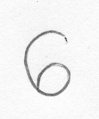
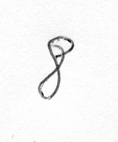
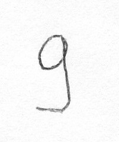
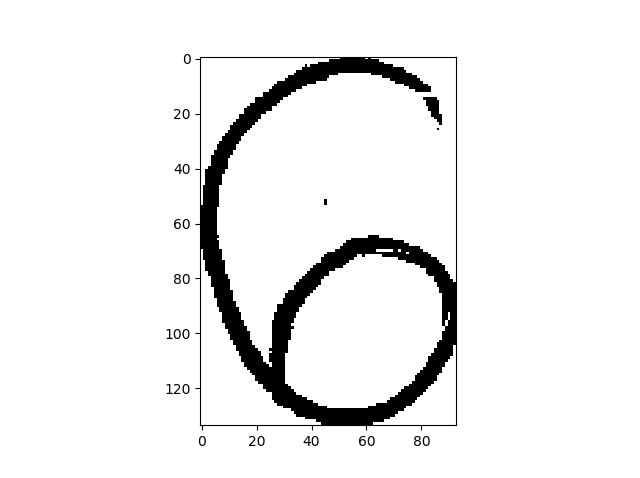
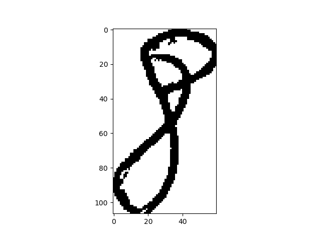
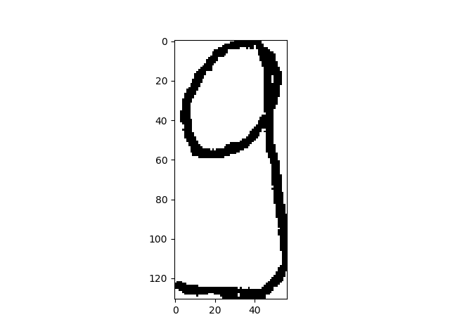
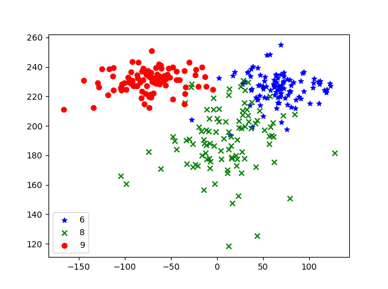

# Handwritten Digit Recognition

> Simple classifier for handwritten digits (6, 8 and 9) classification.

## Requirements

Python 3, and following packages:
- [NumPy](https://www.numpy.org/)
- [Matplotlib](https://matplotlib.org/)
- [Pillow](https://pillow.readthedocs.io/en/stable/)

## Description

The goal is to develop classifier for handwritten digits 6, 8 and 9, based on a Bayesian Hypothesis Testing. Results of the classification are given in the form of the confusion matrix

Examples of the handwritten digits:

  

In order to get better classification results we are cropping and binarizing the images as part of the preprocessing:

  

Feature space:

Results of the classification for three classes (6, 8 and 9)

| 20 | 0  | 0  |
|----|----|----|
| 2  | 17 | 1  |
| 0  | 0  | 20 |